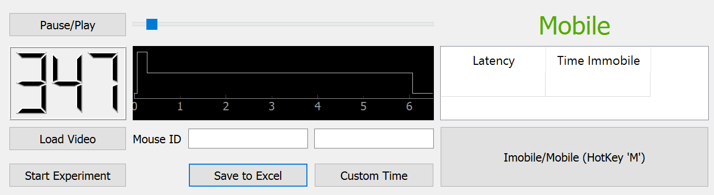

# mobility-mapper

This app allows allows for the scoring of behavioral videos involving mobility (or any other binary behavior). The behavior state is stored for each frame of the video to allow for in depth analysis. Total time immobile and latency to immobility are calculated in the app, but the raw fame-wise state data can also be saved to excel for further analysis.
This app is ideal for manual scoring of behaviors in preparation for training automated bahavior detection using machine learning and DeepLabCut.

# Install Using PIP:

This app runs on python. If new to python, it is recommended to install Anaconda or Miniconda. This will install python along with common packages, and allow you to create isolated environments for each python app.

In your desired environment run: 

    pip install mobility-mapper

In command line:

    python -m mobilitymapper

# How to score a video

1. Select "Load Video" and navigate to desired video. Enter a custom duration and press "Custom Time"(optional).

2. Video will play automatically. When the animals begins the test, select "Start Experiment".

3. Toggle between mobile and immobile using the button or hotkey 'M'.

4. The slider can be used to revisit and revise previous sections of the video. 

5. When the timer reaches zero, total time immobile and latency to first immobility will be displayed.

6. Enter an animal identifier and select save to excel to export the raw data. 

